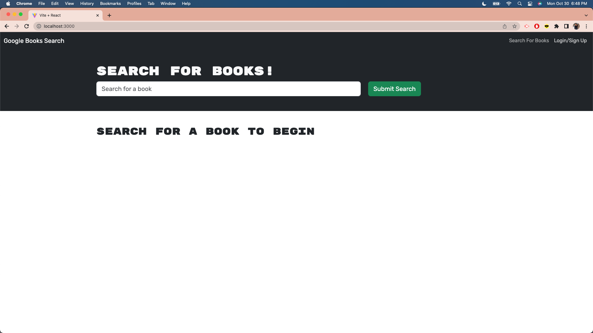
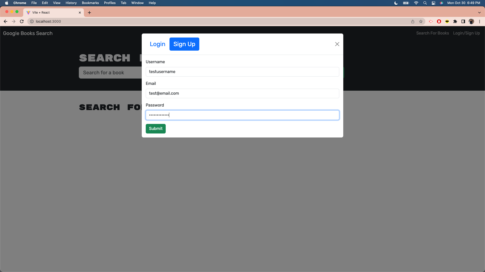
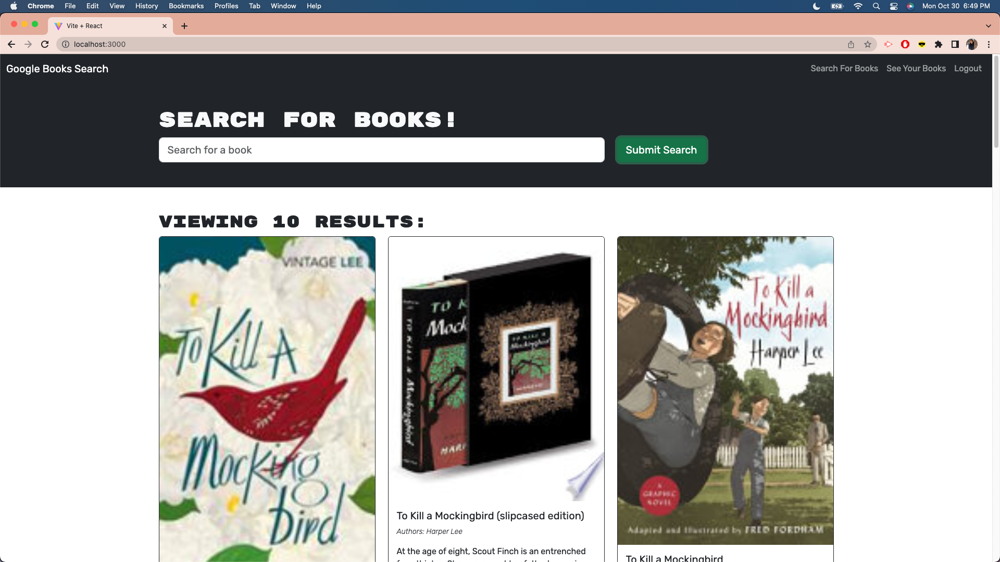
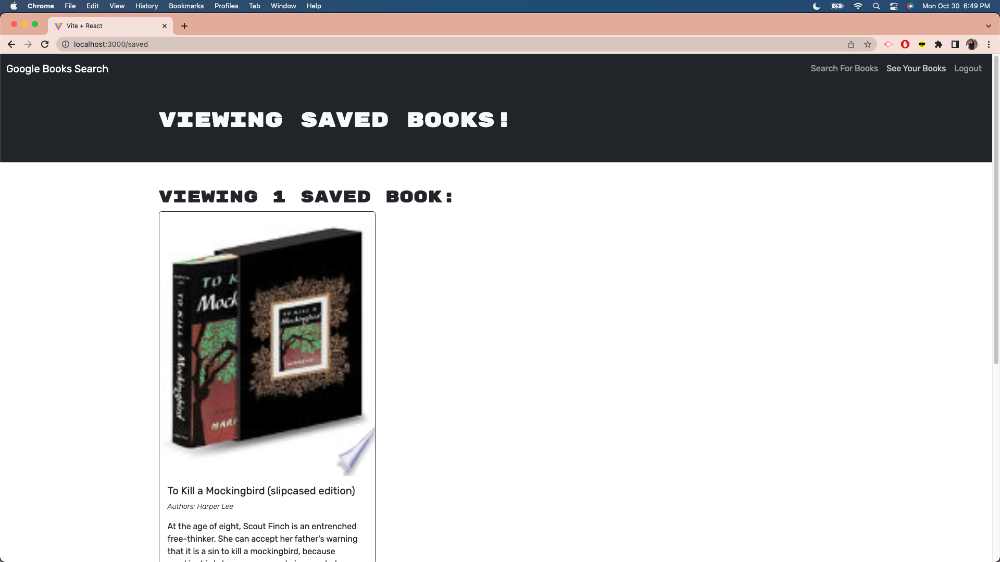
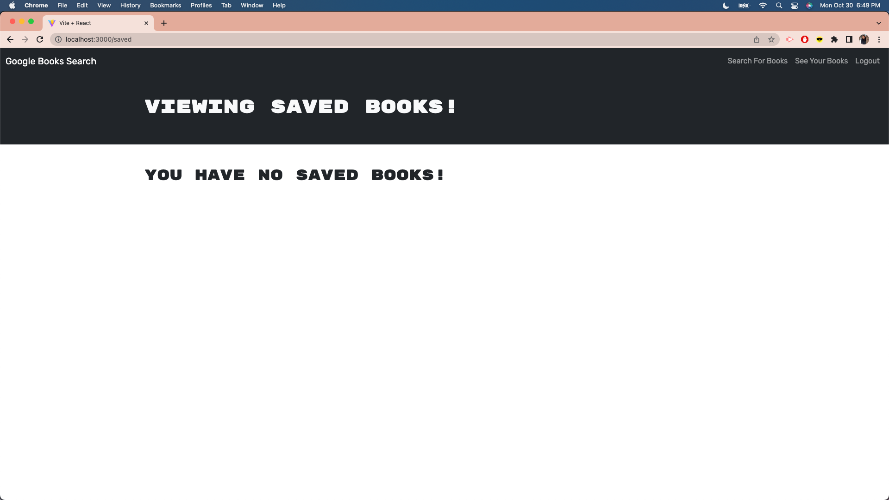

# Book-Search-Engine

## Table of Contents
- [Description](#description)
- [Installation](#installation)
- [Usage](#usage)
- [License](#license)
- [Contribution](#contribution)
- [Tests](#tests)
- [Questions](#questions)

## Description
The purpose of this project is to set up an Apollo Server to use GraphQL queries and mutations to fetch and modify data, replacing the existing RESTful API.
The deployed application can be found here: https://book-search-engine-1lzm.onrender.com/.

## Installation
VS Code to clone the starter code (https://github.com/coding-boot-camp/solid-broccoli)  and to code the front/back end of the application. GibHub for version control. In addition to the starter code, install the following on the client and server level:
@apollo:
https://www.npmjs.com/package/@apollo/client.
https://www.npmjs.com/package/@apollo/server.
graphql:
https://www.npmjs.com/package/graphql.

## Usage
This can be used when clients want to create an application to search and save searched books.

View a screenshot of the homepage, not logged in:

View a screenshot of the signup form:

View a screenshot of searched books after entering a title in the search bar:

View a screenshot of the saved book in “See Your Books” tab:

View a screenshot of the “See Your Books” tab after removing the book:

## License
This project is under the MIT license.

## Contribution
The assignment provided instructions for the backend setup (resolvers, typeDefs, server file) and for the frontend adjustments to be made (queries). The coding in the server.js file and auth file (imports, boilerplate middleware), the coding in the typeDefs file (graphql syntax), the resolvers (queries syntax) -all the additions- are credited to the curriculum taught in the UCI coding boot camp. I also received assistance from the TA and tutor for additions made to the auth/server files, as well as the debugging made to the queries.
To complete the README section, the source is: https://coding-boot-camp.github.io/full-stack/github/professional-readme-guide.
To complete the markdown for the README, the source is: https://www.markdownguide.org/basic-syntax/.
The deploy the application using Render, I referenced: https://www.youtube.com/watch?v=RMNWJ-_8SUU&ab_channel=KerwinTang.

## Tests
To test the functionality of the MERN-Book-Search-Engine, users can clone this repo, run ‘npm install’ in the command line, and start the application’s server with “npm run develop” in the command line. Click on the generated link in the terminal to view the application and perform the actions: sign up, login, search for a book, and save the book. Users can also test the functionality with the deployed application here: https://book-search-engine-1lzm.onrender.com/. 

## Questions
The link to my Github Profile here: https://github.com/codeandlift706.
For any additional questions, please reach me at: channguyen715@gmail.com.

